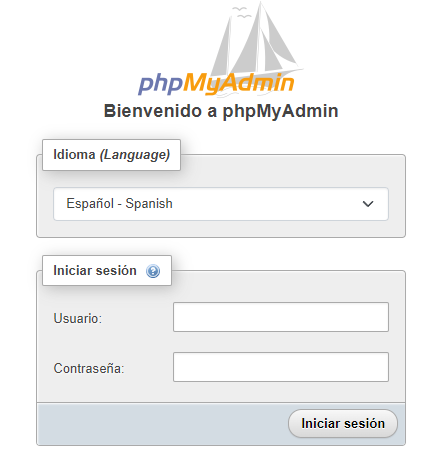
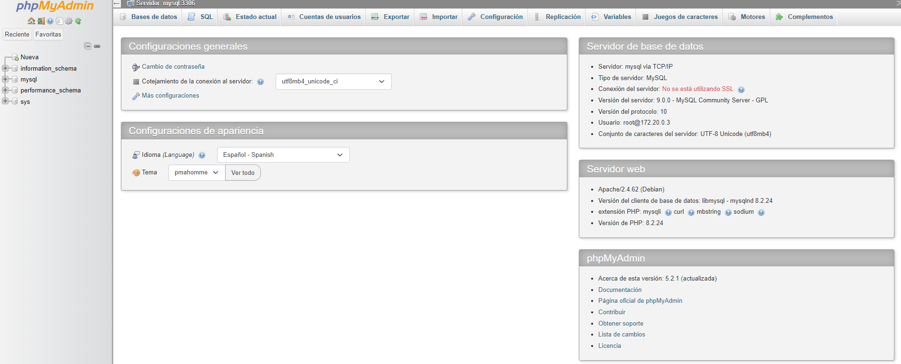

# MYSQL - phpMyAdmin 🛢️ 
Repositorio basico - Docker Mysql y PhpMyadmin


## 📑 Tabla de Contenidos  
1. [Descripción](#descripcion)  
2. [Requerimientos previos](#requerimientos)  
3. [Instalación](#instalacion)  
4. [Uso](#uso)  
5. [Capturas de pantalla](#capturas-pantalla)  
6. [Contribuciones](#contribuciones)  
7. [Licencia](#licencia) 
8. [Contacto](#contacto) 

## 📝 Descripción <a id="descripcion"></a>
- Este repositorio permite levantar un docker con una base de datos MySql y un administrados phpMyAdmin.

## ✅ Requerimientos previos <a id="requerimientos"></a>
- Se debe tener instalado previamente `docker` y `docker-compose`

## 🛠️ Instalación <a id="instalacion"></a> 
```bash
# Clonar el repositorio
git clone https://github.com/inglucasmoreno/mysql-phpmyadmin.git
```

- Crear un archivo `.env` con las siguientes variables de entorno
```bash
MYSQL_ROOT_PASSWORD=
MYSQL_USER=
MYSQL_PASSWORD=
COMPOSE_PROJECT_NAME=db-mysql
```

## 🧑‍💻 Uso <a id="uso"></a> 

```bash
# Iniciar servicios con docker compose
docker compose up -d
```

- Ingresar en el navegador a la direccion `http://localhost:8081` para abrir phpMyAdmin
- Puede comenzar a trabajar con su servicio de MySQL conectandolo a sus aplicaciones a traves del puerto 3310

## 📸 Capturas de Pantalla <a id="capturas-pantalla"></a>
- Login



- Pantalla principal



## 🤝 Contribuciones <a id="contribuciones"></a> 
¡Toda contribución es bienvenida! Por favor sigue los pasos:  
1. Haz un fork del repositorio.  
2. Crea una rama (`git checkout -b feature/nueva-funcionalidad`).  
3. Envía un pull request.

## 📜 Licencia <a id="licencia"></a>  
Este proyecto está bajo la licencia MIT. Consulta el archivo [LICENSE](./LICENSE) para más detalles.

## 📧 Contacto <a id="contacto"></a>  
Hecho por [Ing. Moreno Lucas Omar](https://github.com/inglucasmoreno). 